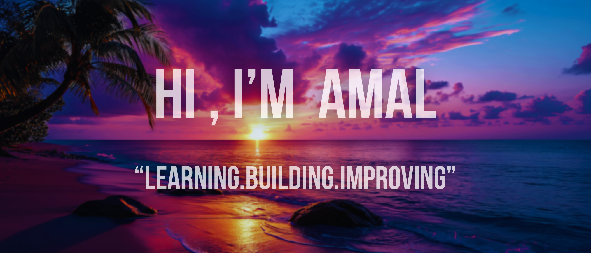

  

<b>🎓 Student | 💻 Aspiring Developer | 🚀 Tech Enthusiast | 📚 Passionate About Teaching</b>
  

## About Me  
- 🔭 Currently focusing on: Data Analysis, Data Science, AI/ML, and Cloud Technologies  
- 🌱 Learning: Python (advanced concepts), along with practical data-driven applications  
- 💡 Interests: Programming, Artificial Intelligence, Technology in Education, and Problem-Solving  
- 📍 Based in India  

---

## Skills  
- *Languages:* Python, C  
- *Tools & Platforms:* GitHub, Linux, Jupyter, VS Code  
- *Focus Areas:* Data Science, Machine Learning, AI, Cloud  

---

## Connect with Me  
- [LinkedIn](https://www.linkedin.com/in/amal-nellanhi)  
- [Email](mailto:amalnellanhi@gmail.com)
