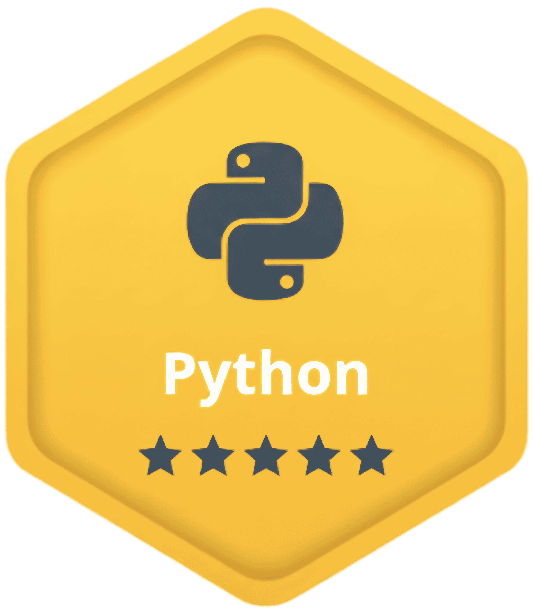

  

  

  

  

I am a **Computer Science student** 🎓 bridging the gap between strong software engineering foundations and the future of AI. I build projects where **Data Structures** meet real-world **Machine Learning** applications ✨. 

My goal isn't just to write code, but to engineer intelligent solutions. I am also deeply passionate about technology education and problem-solving ✨. Currently, I am focusing on **Data Analysis, AI/ML, and Cloud Technologies** and deep diving into **Advanced Python** patterns.

  

  > **"The art of teaching is the art of assisting discovery."**

  

   
  

  ## Technology Stack

  
  
  
  
  

   

  
  
  

  

## My GitHub Stats

 

  

   
  <h3>
    Monthly Coding Activity
  </h3>
  

  
## Achievements & Badges

  
  
  

  

  ## Connect with me

  
  

